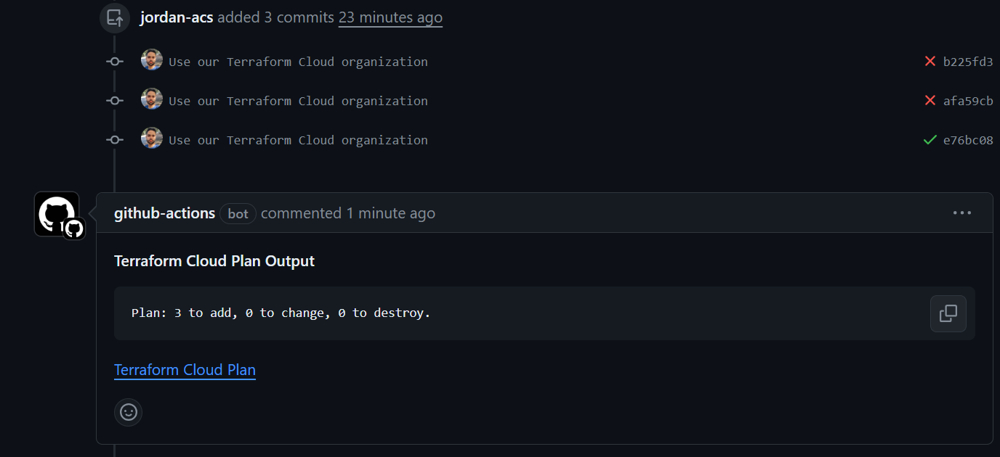
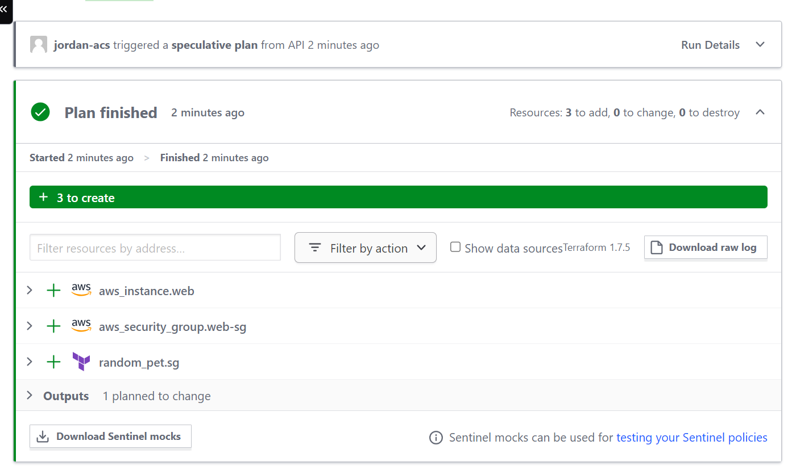

# Automate Terraform with GitHub Actions - Jordan Andrade

## Contexto - Terraforms

Terraform é uma ferramenta de código aberto desenvolvida pela HashiCorp que permite a automação da infraestrutura como código. Em outras palavras, Terraform permite que os desenvolvedores criem, gerenciem e atualizem recursos de infraestrutura de forma programática, utilizando uma linguagem declarativa.

## Como é Utilizado:

Ao invés de configurar manualmente os recursos de infraestrutura, como servidores virtuais, redes, bancos de dados e serviços em nuvem, os usuários podem descrever sua infraestrutura desejada em arquivos de configuração Terraform. Estes arquivos, frequentemente chamados de "scripts de infraestrutura" ou "código Terraform", definem os recursos necessários, suas configurações e dependências.

Após escrever esses scripts, Terraform pode ser executado para provisionar (criar) e gerenciar os recursos automaticamente. Além disso, Terraform permite atualizar e destruir recursos de forma controlada, garantindo que a infraestrutura permaneça consistente com o código declarado.

## Vantagens de Uso:

* Automatização e Consistência: Terraform automatiza a provisionamento da infraestrutura, eliminando erros humanos e garantindo que a infraestrutura seja criada de forma consistente e replicável.

* Flexibilidade e Portabilidade: Terraform suporta uma ampla variedade de provedores de infraestrutura, incluindo AWS, Azure, Google Cloud, VMware e outros. Isso permite aos usuários gerenciar recursos em múltiplas plataformas utilizando uma única ferramenta.

* Infraestrutura como Código (IaC): Ao representar a infraestrutura como código, os usuários podem versionar, revisar e colaborar nos scripts Terraform utilizando ferramentas de controle de versão como Git. Isso facilita o gerenciamento e a manutenção da infraestrutura ao longo do tempo.

* Provisionamento Incremental: Terraform identifica e provisiona apenas as alterações necessárias na infraestrutura, reduzindo o tempo e os recursos necessários para atualizações e implantações.

* Auditoria e Rastreabilidade: Como todos os recursos são definidos em arquivos de configuração, é fácil auditar e rastrear as mudanças na infraestrutura ao longo do tempo, o que é crucial para garantir conformidade e segurança.

## Importância:

Com a crescente complexidade das infraestruturas de TI e a adoção generalizada de ambientes de nuvem, ferramentas como Terraform se tornaram essenciais para organizações que buscam agilidade, eficiência e consistência na gestão de infraestrutura. Ao adotar práticas de infraestrutura como código e automatização, as empresas podem acelerar o ciclo de desenvolvimento, melhorar a confiabilidade da infraestrutura e reduzir custos operacionais. Em resumo, Terraform desempenha um papel fundamental na modernização e otimização das operações de TI.

## Prints da execução

# Conteúdos Aprendidos

* Infraestrutura como Código (IaC): Essa atividade baseou-se no uso do Terraform para definir e gerenciar a infraestrutura como código. Isso implica em entender os princípios e práticas de IaC, onde a infraestrutura é descrita em arquivos de configuração e provisionada automaticamente a partir desses arquivos.

* Terraform: Para concluir a atividade, foi necessário entender os conceitos básicos do Terraform, incluindo a sintaxe da linguagem HCL (HashiCorp Configuration Language), recursos Terraform (providers, resources, data sources, etc.), e os comandos básicos para executar as operações (init, plan, apply, etc.).

* GitHub Actions: Essa atividade envolve a utilização do GitHub Actions para automatizar o processo de provisionamento da infraestrutura com Terraform. Isso inclui entender como criar workflows (fluxos de trabalho) no GitHub Actions, definir os gatilhos para iniciar esses workflows (por exemplo, push para um repositório, pull request, etc.), e entender os diferentes tipos de ações disponíveis para automatizar tarefas específicas.

